FS510 -  METODO MONTECARLO
=====

## Simulazione di eventi

###### di Maria Teresa Graziano

---

## Partiamo da un evento semplice: 
# Le pile di sabbia

---

# Definizione del modello

---

# Automi cellulari (CA)

Il modello di una pila di sabbia usa una struttura di automi cellulari.

Un automa cellulare (CA) è un **sistema dinamico discreto**  che ha la capacità di descrivere un **sistema dinamico continuo**.
L’idea che sta alla base dei CA è quella della simulazione attraverso l’interazione delle celle seguendo semplici regole. 
I CA non servono per descrivere un sistema complesso con equazioni complesse ma per lasciare che la complessità emerga dall’interazione di semplici elementi che seguono semplici regole. 

---
# Come si usano? 

Un CA è composto da pochi semplici elementi:

- la cella

- il reticolo

- il vicinato

- le regole

---

Consideriamo un reticolo 1-D composto da N celle, ognuna collegata ai suoi immediati vicini di destra e di sinistra.
Con questo reticolo vogliamo discretizzare la variabile a valori reali $S_j^n$, dove $j$ identifica il nodo sul reticolo e $n$ denota l'iterazione temporale.

###### Meccanismo di forzatura

Ad ogni iterazione temporale $n$, un piccolo incremento $s$ viene aggiunto alla variabile $S$ ad un nodo $j$ selezionato casualmente.
$$S^{n+1}_j=S^n_j+s$$

con $j \in [0,N-1]$, $s \in [0,\varepsilon]$ estratti casualmente da una distribuzione uniforme tra gli intervalli dati.

---

###### Calcolo della pendenza

Poichè ad ogni iterazione la variabile $S$ cresce possiamo calcolare la pendenza associata a ciascuna coppia nodale $(j,j+1)$.
$$z_j^n=|S^n_{j+1}-S^n_j|$$
con $j=0,...,N-2$.
Se questa pendenza supera la soglia critica preimpostata $Z_c$ allora la coppia nodale è considerata instabile. 

---
###### Regola di ridistribuzione
$$S^{n+1}_j=S^n_j+\frac{1}{2}(\bar S-S^n_j)$$
$$S^{n+1}_{j+1}=S^n_{j+1}+\frac{1}{2}(\bar S-S^n_{j+1})$$
dove 
$$\bar S=\frac{1}{2}(S^n_{j+1}+S^n_j)$$

Questa regola è conservativa, poichè vale:
$$S^{n+1}_j+S^{n+1}_{j+1}=S^n_j+S^n_{j+1}$$

e la quantità spostata è $\delta S^n_j=z^n_j/4$.
Ad ogni iterazione rimuoviamo la quantità accumulata all'ultimo nodo $S^n_{N-1}=0$.

---

<center>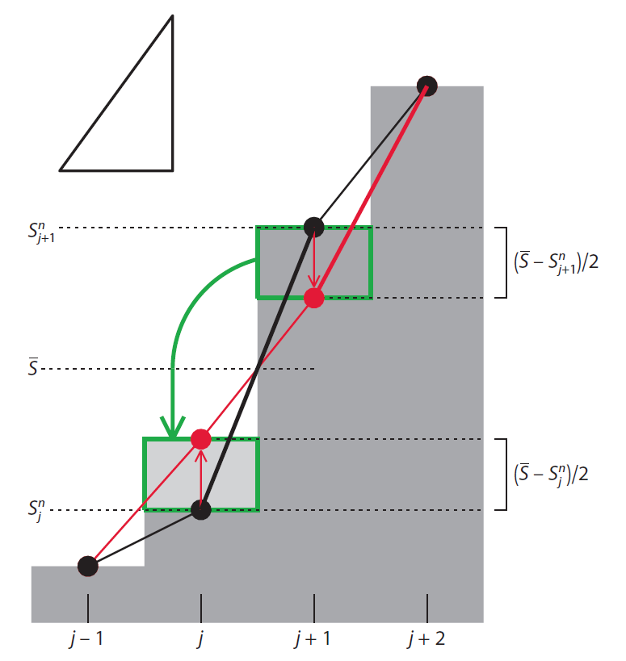

---

# Implementazione e simulazione rappresentativa 

---
###### Dati iniziali
```
import numpy as np
import matplotlib.pyplot as plt
	
N=100 
E=0.1
critical_slope=5
n_iter=100000 
	
sand=np.zeros(N) 
tsav=np.zeros(n_iter)
mass=np.zeros(n_iter)
```	
---
###### Implementazione del modello
```		
for iterate in range(0,n_iter): 
	move=np.zeros(N)
    	for j in range(0,N-1): 
        	slope=abs(sand[j+1]-sand[j])
        	if slope >= critical_slope: 
            		avrg=(sand[j]+sand[j+1])/2 
            		move[j]+=(avrg-sand[j])/2   
            		move[j+1]+=(avrg-sand[j+1])/2
            		tsav[iterate]+=slope/4 
   
    	if tsav[iterate]>0:  
    		sand+=move
    	else: 
        	j=np.random.randint(0,N-1) 
        	sand[j]+=np.random.uniform(0,E)
            
    	sand[N-1]=0 
    	mass[iterate]=np.sum(sand) 
```	                
---

<center>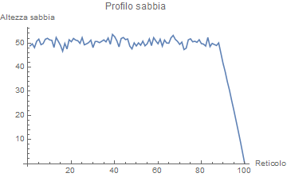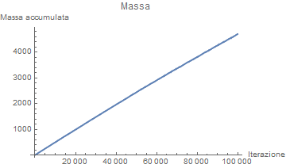
------
<center>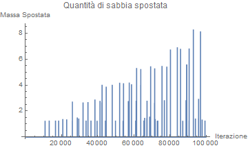

---

#### Visualizzazione dei valori della massa spostata
Valori tra $1$ e $5*10^4$ iterazioni:

<center>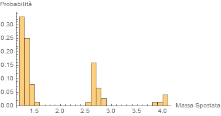
-----
Valori tra $5*10^4$ e $10^5$ iterazioni:

<center>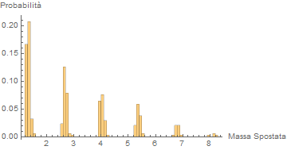

---

# Studio dell'angolo di riposo 

---

Verifichiamo che la pendenza della pila nello stato statisticamente 
stazionario è minore della pendenza critica data. 
Questo è dovuto al meccanismo di forzatura che porta all'instabilità di una coppia nodale prima che questa ha raggiunto la pendenza critica.

```
r=9
matrix=np.zeros((r,N))

for i in range(1,r+1):
  	sand=np.zeros(N) 
   	tsav=np.zeros(i*(10**5)) 
   	mass=np.zeros(i*(10**5))
```    
---
```
    for iterate in range(0,i*(10**5)):
        move=np.zeros(N)
        for j in range(0,N-1):
            slope=abs(sand[j+1]-sand[j])
            
            if slope >= critical_slope: 
                avrg=(sand[j]+sand[j+1])/2 
                move[j]+=(avrg-sand[j])/2   
                move[j+1]+=(avrg-sand[j+1])/2
                tsav[iterate]+=slope/4 
   
        if tsav[iterate]>0: 
            sand+=move
        else: 
            j=np.random.randint(0,N-1) 
            sand[j]+=np.random.uniform(0,E)
            
        sand[N-1]=0 
        mass[iterate]=np.sum(sand)
       
    for j in range(0,N-1):
        matrix[i-1][j]=sand[j]
        
```
---
Con array sand inizialmente nullo, o caricato uniformemente ad un'altezza fissa:
<center>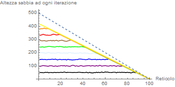
-
Con array sand inizialmente già all'angolo di riposo:
<center>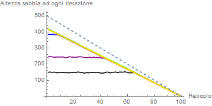


  
---
Quindi possiamo concludere che il sistema si stabilizza a una pendenza media minore di $Z_c$ e che si avvicina a $Z_c$ sono nel limite $\varepsilon \to 0$, indipendentemente dalle condizioni iniziali.

```
repliche=500
slopeArray=np.zeros(repliche)

for i in range(0,repliche): 
    sand=np.zeros(N)
    tsav=np.zeros(n_iter) 
    r=0
    a=0
    for iterate in range(0,n_iter): 
        move=np.zeros(N)
        if a==1:
            for j in range(0,N-1): 
                slope=abs(sand[j+1]-sand[j])
                if slope >= critical_slope: 
                    avrg=(sand[j]+sand[j+1])/2 
                    move[j]+=(avrg-sand[j])/2   
                    move[j+1]+=(avrg-sand[j+1])/2
                    tsav[iterate]+=slope/4 
```

---

```
        else:
            for j in range(r-1,r+2): 
                if j==-1 or j==N-1 or j==N:
                    break    
                else:
                    slope=abs(sand[j+1]-sand[j])
                    if slope >= critical_slope: 
                        avrg=(sand[j]+sand[j+1])/2 
                        move[j]+=(avrg-sand[j])/2   
                        move[j+1]+=(avrg-sand[j+1])/2
                        tsav[iterate]+=slope/4 
   
        if tsav[iterate]>0: 
            sand+=move
            a=1
        else: 
            j=np.random.randint(0,N-1) 
            sand[j]+=np.random.uniform(0,E)
            r=j
            a=0
         
        sand[N-1]=0 
        
    slopeArray[i]=sand[N-2]
```
---

Per E=0.01 e 500 repliche: 
<center>

---

Per E=0.1 e 500 repliche: 
<center>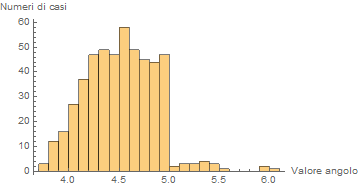

---

Per E=1 e 500 repliche: 
<center>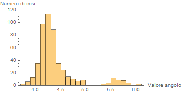

---
Da scrivere qualcosa
<center>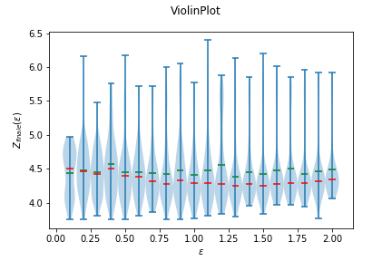

---

# Studiamo la massa e la massa spostata

---
- Massa: la quantità totale di sabbia nella pila ad ogni iterazione $n$
$$M^n=\sum_{j=0}^{N-1}S^n_j$$
- Massa spostata: somma della quantità di massa spostata ad ogni iterazione $n$ nel corso di una valanga.
$$\Delta M^n=\sum_{j=0}^{N-2}\delta S^n_j$$
dove $\delta S^n_j$ è la quantità spostata.

---
Grafico della massa generato su $2*10^6$ iterazioni:
<center>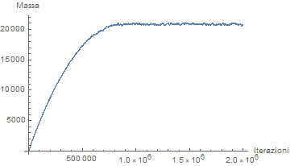
--
Zoom su valori tra $16*10^5$ e $16.2*10^5$:
<center>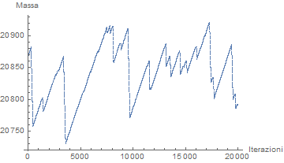

---

Grafico della massa spostata generato su $2*10^6$ iterazioni:
<center>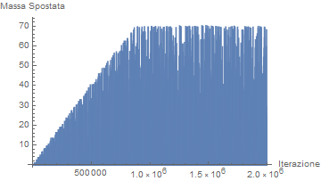
--
Zoom su valori tra $16*10^5$ e $16.2*10^5$:
<center>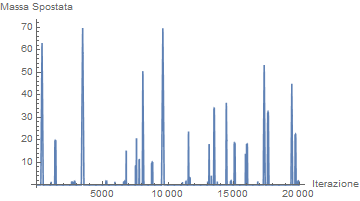

---

# Misuriamo le valanghe
---
Le valanghe sono diverse in dimensione e forma.
Definiamo tre quantità globali che caratterizzano ciascuna valanga:
- Energia delle valanghe $E$: la somma di tutte le masse spostate
$\Delta M^n$ per tutta la durata di una valanga;
- Picco della valanga $P$: il più grande valore $M^n$ prodotto nel corso della valanga;
- Durata della valanga $T$: il numero di iterazioni intercorse
tra l'innesco di una valanga e l'ultimo locale
ridistribuito.

Queste tre quantità possono essere facilmente estratte dalla serie temporale della massa spostata.

---
```
def measure_av(n_iter,tsav): 
    n_max_av=10000 
    e_av=np.zeros(n_max_av) 
    p_av=np.zeros(n_max_av) 
    t_av=np.zeros(n_max_av) 
    n_av,somma,istart,avmax=-1,0,0,0
    
    for iterate in range(1,n_iter): 
        if tsav[iterate]>0 and tsav[iterate-1]==0: 
            somma,avmax=0,0 
            istart=iterate
            if n_av==n_max_av-1: 
                print("troppe valanghe")
                break
            n_av+=1 
        somma+=tsav[iterate] 
        if tsav[iterate]>avmax: 
            avmax=tsav[iterate] 
        if tsav[iterate]<=0 and tsav[iterate-1]>0:
            e_av[n_av]=somma
            p_av[n_av]=avmax
            t_av[n_av]=iterate-istart
                
    return n_av,e_av,p_av,t_av
```
---

<center>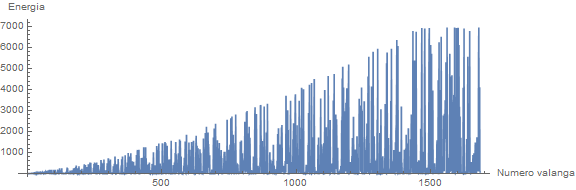
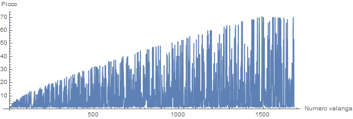
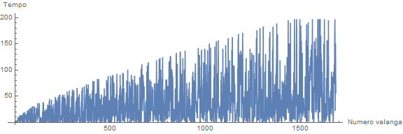

---
# Correlazione
<center>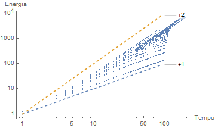

In questo grafico Log-Log: correlazione tra energia $E$ e durata $T$ nello stato statisticamente stazionario, $E$ ∝ $T$ e $E$ ∝ $T^2$  

---

La più piccola quantità di massa spostata che può essere prodotta è 
$$\delta S^n_j=Z_c/4=\delta M_0$$
Se supponiamo che il reticolo si trova ovunque all'angolo di riposo, allora la massa si sposterà verso il basso lungo la pendenza, un nodo ad ogni iterazione, fino a quando non raggiungerà il confine aperto. Quindi se il nodo instabile di partenza si trova a M nodi di distanza dal confine aperto allora avrà durata $T=M$ ed energia $E=M*\delta M_0$ quindi $E=\delta M_0T$, cioè una relazione lineare.
La relazione quadratica è associata invece a valanghe che si diffondono sia in salita che in discesa, in tutti i nodi nel mezzo si hanno valanghe  ripetutamente fino alla stabilizazione, che avviene una volta terminata la valanga oppure se la massa è evacuata al confine aperto. Quindi il numero dei nodi su cui avvengono valanghe crescono linearmente con $T$.

---
# PDF (Invarianza di scala)
I **PDF** per $E$ e per $P$ assumono la forma di legge di potenza $f(x)=a*x^b$, con pendenza logaritmica indipendente dalla dimensione del reticolo. Una volta raggiunto lo stato statico stazionario, all'aumentare di $N$ la distribuzione si estende verso destra.
<center>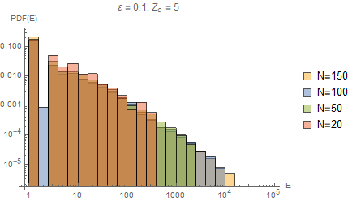 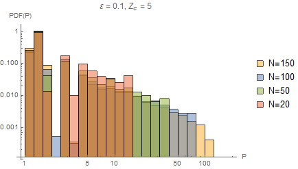

---
###### Codice da inserire per il calcolo del valore di $b$:
```
#pacchetto da importare
from scipy.optimize import curve_fit

#dati inziali
E=0.1, N=50
repliche=500
EnfitArray=np.zeros(repliche)
PfitArray=np.zeros(repliche)

#da inserire nel ciclo
n_av,e_av,p_av,t_av=measure_av(n_iter,tsav)

xdata,ydata=np.histogram(e_av,range=(e_av.min()+1, e_av.max()))
popt, pcov = curve_fit(func, np.log(ydata[1:]),np.log(xdata))
EnfitArray[i]=popt[1]

xdata,ydata=np.histogram(p_av,range=(p_av.min()+1, p_av.max()))
popt, pcov = curve_fit(func, np.log(ydata[1:]),np.log(xdata))
PfitArray[i]=popt[1]
```    
---
Il valore $b$ più frequente è:
- $b=-2.18$ per la pendenza di E
- $b=-1.80$ per la pendenza di P
<center>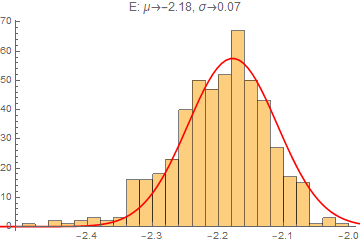 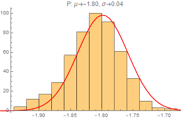

---
### Studio della pendenza al variare di $\varepsilon$ e $Z_c$ 

Per valori di $\varepsilon=1$ e $Z_c=5$:
- $b=-1.2$ per la pendenza di $E$
- $b=-3.5$ per la pendenza di $P$
<center>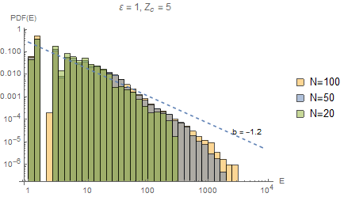 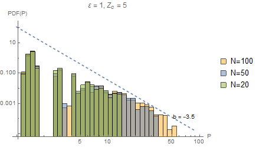 

---
Per valori di $\varepsilon=0.1$ e $Z_c=7$:

- $b=-1.3$ per la pendenza di $E$
- $b=-1.5$ per la pendenza di $P$
<center>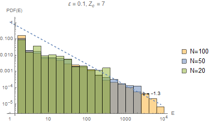 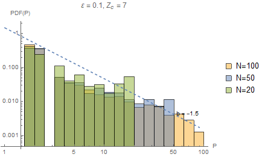 


---

Per raggiungere lo stato statisticamente stazionario il nostro modello utilizza valanghe con invarianza di scala. Poichè molti sistemi si comportano in questo modo, le pile di sabbia sono diventate le icone per il concetto di criticità auto-organizzata.
La criticità qui la troviamo nell'angolo di riposo del mucchio:
- se la pendenza è inferiore all'angolo di riposo, l'aggiunta di sabbia può solo far crescere il mucchio o innescare piccole valanghe, confinate spazialmente.
- se la pendenza globale è superiore all'angolo di riposo, allora sicuramente ci sono valanghe in atto.
-  se la pendenza è uguale all'angolo di riposo allora l'aggiunta di sabbia su un unico nodo può o portare a nulla o innescare una valanga lungo tutto il pendio.

---
# Criticità auto-organizzata
E' una teoria che spiega la dinamica dei grandi sistemi interattivi, dalle valanghe, ai terremoti, ai mercati finanziari: tutti evolvono verso uno stato critico in cui anche un piccolo evento può innescare una catastrofe.

Un sistema con criticità auto-organizzata deve essere:

- aperto e dissipativo;
- caricato da forzatura lenta;
- sottoposto a una soglia locale di instabilità. . .
- . . . che ripristina la stabilità attraverso il riadattamento locale.

---
## Variazione del modello delle pile di sabbia:
# I terremoti

---
# Modello Burridge-Knopoff

La maggior parte dei terremoti si verifica per lenti movimenti della crosta terrestre e della litosfera. Gli strati della litosfera che lentamente si spostano vengono dette faglie. Quando una faglia ne comprime un'altra vincendo la forza d'attrito, si determina un veloce slittamento con un improvviso rilascio di energia, che fa vibrare la crosta terrestre deteminando il terremoto.

---
Il **modello BK** è un costrutto meccanico definito come una matrice di blocchi tra due piastre.
Ogni blocco $(i,j)$ è connesso ai suoi 4 vicini, $(i - 1, j), (i + 1, j), (i, j - 1),(i, j + 1)$, tramite una molla con costante $K$ (in rosso), ed è connesso con un'altra molla con costante $K_L$ (in verde) alla piastra superiore, che si muove a velocità costante $V$, lungo la direzione $x$.
La piastra inferiore invece è fissa.
Il movimento della piastra superiore allungherà la molla, aumentando così l'intensità della forza, nella componente $x$, che agisce su ciascun blocco.

---
<center>

---
Per la legge di Hooke:
$$F_x=K\Delta x$$
dove $K$ è la costante della molla e $\Delta x = x_{i, j}$ è lo spostamento calcolato come distanza tra il centro del blocco e il punto di ancoraggio della molla.

La componente $x$ della forza totale che agisce sul blocco $(i,j)$ è quindi data da:
$$F^n_{i,j}=K(x^n_{i-1,j}+x^n_{i+1,j}+x^n_{i,j-1}+x^n_{i,j+1}-4x^n_{i,j})-K_Lx^n_{i,j}$$
Consideriamo ora la forza di attrito $F_c$ tra il blocco e la piastra inferiore:
- se $F_{i,j} \leq F_c$ il blocco è stabile e resta a riposo
- altrimenti scivola 

---
Dopo lo slittamento il blocco raggiunge una posizione di equilibrio dove la forza totale è nulla:
$$F^{n+1}_{i,j}=K(x^n_{i-1,j}+x^n_{i+1,j}+x^n_{i,j-1}+x^n_{i,j+1}-4x^{n+1}_{i,j})$$
$$-K_Lx^{n+1}_{i,j}=0$$

Quindi la variazione della forza totale sul blocco è data da:
$$\delta F_{i,j}=F^{n+1}_{i,j}-F^n_{i,j}=(4K+K_L)(x^{n+1}_{i,j}-x^n_{i,j})$$
$$\delta F_{i,j}=-F^n_{i,j}$$

---
Se lo slittamento è avvenuto solo al blocco $(i,j)$, allora la variazione della forza totale che agisce su un blocco adiacente, ad esempio il blocco $(i+1,j)$, è:
$$\delta F_{i+1,j}=K(x^{n+1}_{i,j}-x^n_{i,j})$$

Per il terzo principio della dinamica deve valere:
$$\delta F_{i,j}=\delta F_{i+1,j}$$
e sostituendo otteniamo 
$$\delta F_{i+1,j}=\alpha F^n_{i,j}$$

dove $\alpha = \frac{K}{4K+K_L}$ è un valore nell'intervallo $[0,\frac{1}{4}]$.

---
# Definizione del modello OFC

Basandoci sul modello di scorrimento di Burridge-Knopoff, il modello di Olami-Feder-Christensen è una semplice variazione del modello delle pile di sabbia che utilizza un reticolo 2-D composto da $N$ x $N$ celle, con 4 vicini: nord, sud, est e ovest. 
Con questo reticolo vogliamo discretizzare la variabile a valori reali $F_{i,j}^n$, dove $(i,j)$ identifica il blocco sul reticolo e $n$ denota l'iterazione temporale.

###### Condizione iniziale

$F^0_{i,j}=r$ $\forall i,j$ e $r \in [0,F_c]$ è estratta casualmente da una distribuzione uniforme nell'intervallo dato.

---

###### Meccanismo di forzatura

Ad ogni iterazione temporale $n$, un piccolo incremento costante, scelto in input, $\delta F$ viene aggiunto alla variabile $F$ ad ogni blocco del reticolo.
$$F^{n+1}_{i,j}=F^n_{i,j}+\delta F \space \forall i,j$$ 

###### Valore soglia

Ad ogni iterazione la variabile $F$ aumenta.
Se la forza totale su un blocco $(i,j)$ supera la soglia critica preimpostata $F_c$
$$F_{i,j}^n>F_c$$
allora il blocco è considerato instabile. 

---
###### Regola di ridistribuzione
Il blocco a questo punto viene portato a uno stato di forza zero e ridistribuisce la forza ai 4 vicini:

$$F^{n+1}_{i,j}=0$$
$$F^{n+1}_{nn}=F^{n}_{nn}+\alpha F^{n}_{i,j}$$
dove $nn$ ≡ $[(i + 1, j), (i - 1, j), (i, j + 1), (i, j - 1)]$ e $\alpha \in [0,0.25].$
Se $\alpha<0.25$ il modello OFC non è conservativo poichè la forza totale è minore dopo un evento di redistribuzione.

---
<center>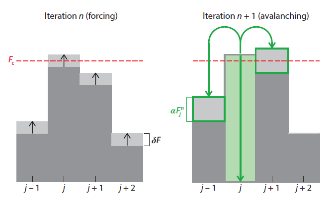

---

# Implementazione e simulazione rappresentativa  

---
###### Dati iniziali
```
import numpy as np
import matplotlib.pyplot as plt

N=64
f_thresh=5. 
delta_f=1.e-4 
alpha=0.15 
n_iter=200000 


dx=np.array([-1,0,1,0])  
dy=np.array([0,-1,0,1])    
force=np.zeros([N+2,N+2])
toppling=np.zeros(n_iter,dtype="int") 
totalf=np.zeros(n_iter,dtype="int")
forcediss=np.zeros(n_iter)

for i in range(1,N+1):
    for j in range(1,N+1):
        force[i,j]=f_thresh*(np.random.uniform())
```
---
###### Implementazione del modello
```
for iterate in range(0,n_iter): 
    move=np.zeros([N+2,N+2])  
       
    for i in range(1,N+1):
        for j in range(1,N+1):
            if force[i,j]>=f_thresh:
                move[i,j]-=force[i,j] 
                move[i+dx[:],j+dy[:]]+=alpha*force[i,j] 
                toppling[iterate]+=1 
                forcediss[iterate]+=(1-4*alpha)*force[i,j]
                
    if toppling[iterate]>0: 
        force+=move 
    else: 
        force[:,:]+=delta_f 
        
    totalf[iterate]=force.sum()
   
```
---

<center>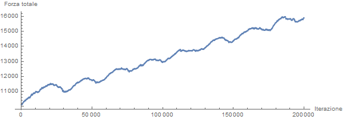
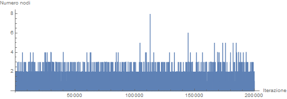

---
Se $\alpha$ < 0.25
<center>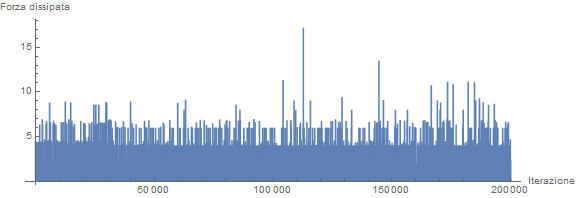
-
Se $\alpha$ = 0.25
<center>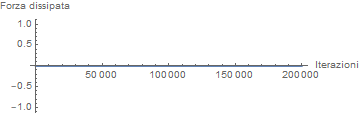

---

# Comportamento del modello 

---
###### Dati iniziali
Tengo da parte i valori della forza di 3 blocchi scelti casualmente:

```
forcenode1=np.zeros(n_iter)
forcenode2=np.zeros(n_iter)
forcenode3=np.zeros(n_iter)
        
iterate=0
forcenode1[iterate]=force[32,32]
forcenode2[iterate]=force[7,14]
forcenode3[iterate]=force[51,43]
```
---
###### Codice velocizzato
```
while(iterate < n_iter):
           
    move=np.zeros([N+2,N+2]) 
    for i in range(1,N+1):
        for j in range(1,N+1):
            if force[i,j]>=f_thresh: 
            	#alpha=np.random.uniform(0.10,0.20)
                move[i,j]-=force[i,j] 
                move[i+dx[:],j+dy[:]]+=alpha*force[i,j] 
                toppling[iterate]+=1 
                forcediss[iterate]+=(1-4*alpha)*force[i,j]
```
---
```
    if toppling[iterate]>0: 
        force+=move
        iterate=iterate+1
        totalf[iterate]=force[1:-1,1:-1].sum()
        forcenode1[iterate]=force[32,32]
        forcenode2[iterate]=force[7,14]
        forcenode3[iterate]=force[51,43]
    else:
        passi=int((f_thresh-np.amax(force[1:-1,1:-1]))
        					/delta_f)+1
        for k in range(0,passi):
            force[:,:]+=delta_f
            
            if iterate+k>=n_iter:
                break
            else:
            	forcenode1[iterate+k+1]=force[32,32]
                forcenode2[iterate+k+1]=force[7,14]
               	forcenode3[iterate+k+1]=force[51,43]
                totalf[iterate+k+1]=force[1:-1,1:-1].sum()
                
        iterate=iterate+passi
```
---
# Studio del modello al variare di $\alpha$

---
Se $\alpha$ rimane costante, cioè uguale ad ogni scossa, si può notare la periodicità in alcuni intervalli:

Per $\alpha$ = 0.15
<center>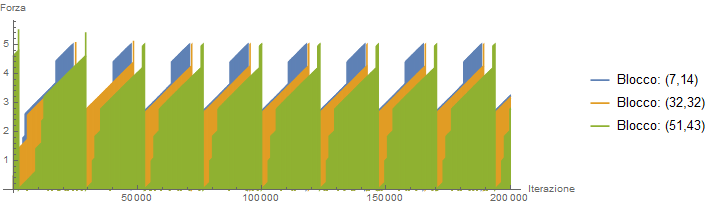

---

Per $\alpha$ = 0.20
<center>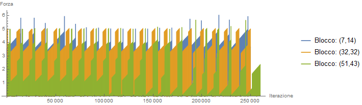
-
Per $\alpha$ = 0.25
<center>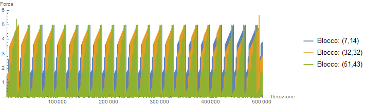

---

Se $\alpha$ è una variabile casuale estratta da una distribuzione uniforme nell'intervallo $[0.10,0.20]$ allora vediamo che la quasi-periodicità si perde:
<center>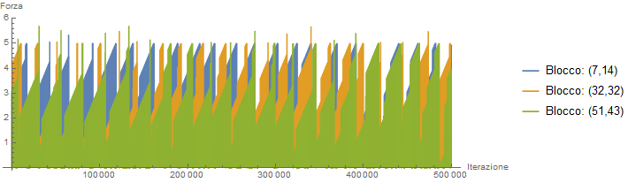

---

# Caratteristiche delle scosse

---
```
def dettagli_terremoto(n_iter,toppling): 
   
    n_max_av=100000 
    t_av=np.zeros(n_max_av) 
    istart,n_av,nodi=0,-1,0
    noditot=np.zeros(n_max_av)
    
    for iterate in range(1,n_iter): 
    	if toppling[iterate]>0 and toppling[iterate-1]==0: 
            nodi=0
            istart=iterate
            if n_av==n_max_av-1: 
                print("troppe valanghe")
                break
            n_av+=1
        nodi+=toppling[iterate]
        if toppling[iterate]<=0 and toppling[iterate-1]>0:
            t_av[n_av]=iterate-istart
            noditot[n_av]=nodi
                
    return n_av,t_av,noditot
```

---
I **PDF** per $E$, la misura della dimensione di una scossa, cioè il numero totale di blocchi coinvolti, assume la forma di legge di potenza $f(x)=a*x^b$, con pendenza logaritmica dipendente dal valore di $\alpha$. 

<center>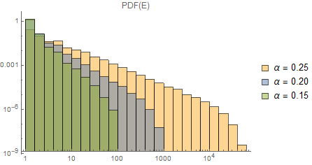

---
# Fit della pendenza logaritmica

<center>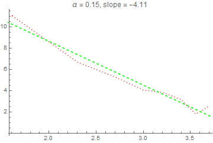 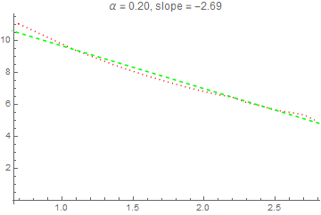
-
<center>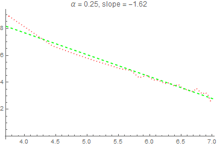

---
Se invece manteniamo $\alpha$ costante a 0.15 e calcoliamo la PDF al variare della dimensione del reticolo,  notiamo che anche in questo caso abbiamo un invarianza di scala, proprio come nel modello delle pile di sabbia.
<center>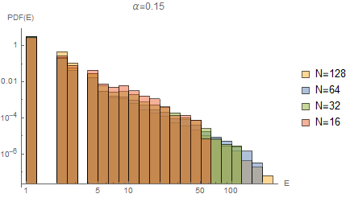

---
# Correlazione tra dimensione e durata delle scosse
### Grafici di tipo Log-Log:
Per $\alpha=0.15$, indice di correlazione = 0.904601
<center>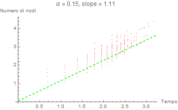

---
Per $\alpha=0.20$, indice di correlazione = 0.889106
<center>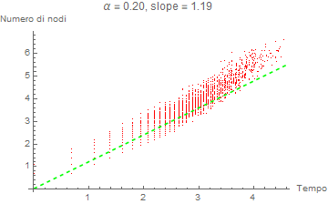

---
Per $\alpha=0.25$, indice di correlazione = 0.863459
<center>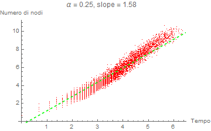

---
